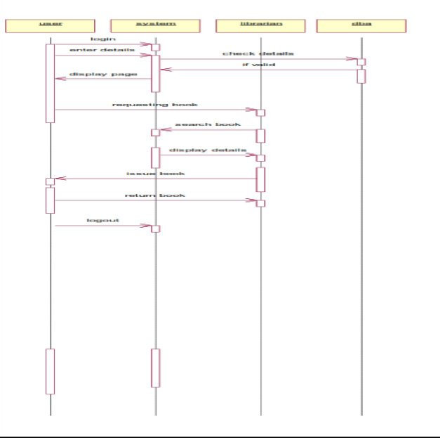

# **Ex. No. 1:**
**PASSPORT AUTOMATION SYSTEM**

x no:1Date:

# **AIM:**
To create an automated system to perform the Passport Process.

1) # **PROBLEM STATEMENT:**

Passport Automation System is used in the effective dispatch of passport to all of the applicants. This system adopts a comprehensive approach to minimize the manual work and schedule resources, time in a cogent manner. The core of the system is to get the online registration form (with details such as name, address etc.,) filled by the applicant whose testament is verified for its genuineness by the Passport Automation System with respect to the already existing information in the database.
# **( II )SOFTWARE REQUIREMENT SPECIFICATION: 2.1SOFTWARE INTERFACE**
0. **Front End Client** - The applicant and Administrator online interface is built using

JSP and HTML. The Administrators's local interface is built using Java.

0. **Web Server** - Glassfish application server(Oracle Corporation).
0. **Back End** - Oracle database.

# **2.2HARDWARE INTERFACE**

The server is directly connected to the client systems. The client systems have access to the database in the server.

# **( III ) USECASE DIAGRAM :**
registration

*enter applicant id*

check status

administrator

applicant

process applicant

dispatch passport

# **Fig.3. USECASE DIAGRAM FOR PASSPORT AUTOMATION SYSTEM**

4) **ACTIVITY DIAGRAM:**

# **Fig.4.1. ACTIVITY DIAGRAM FOR REGISTER**

**Fig.4.2. ACTIVITY DIAGRAM FOR ADMINISTRATION**

# **Fig.4.3. ACTIVITY DIAGRAM FOR CHECKING STATUS**

4) **CLASS DIAGRAM:**

The class diagram, also referred to as object modeling is the main static analysis diagram. The main task of object modeling is to graphically show what each object will do in the problem domain. The problem domain describes the structure and the relationships among objects.

The Passport Automation system class diagram consists of four classesPassport Automation System

1. New registration
1. Gender
1. Application Status
1. Admin authentication
1. Admin Panel

# **Fig.5. CLASS DIAGRAM FOR PASSPORT AUTOMATION SYSTEM**

4) **INTERACTION DIAGRAM:**

A sequence diagram represents the sequence and interactions of a given USE-CASE or scenario. Sequence diagrams can capture most of the information about the system. Most object to object interactions and operations are considered events and events include signals, inputs, decisions, interrupts, transitions and actions to or from users or external devices.

An event also is considered to be any action by an object that sends information. The event line represents a message sent from one object to another, in which the “form” object is requesting an operation be performed by the “to” object. The “to” object performs the operation using a method that the class contains.

It is also represented by the order in which things occur and how the objects in the system send message to one another.

The sequence diagram for each USE-CASE that exists when a user administrator, check status and new registration about passport automation system are given.

database

application

admin panel

system

administrator

1: 1.username\password

2: authetication suceed

3: details of application yet to be released

4: details of application dispatched

5: enter applicant id to process

6: give details

7: dispatch eligible passports

database

application

admin panel

system

administrator

# **Fig.6.1.SEQUENCE DIAGRAM FOR ADMINISTRATOR**

5: enter applicant id to process	4: details of application dispatched

7: dispatch eligible passports

6: give details

3: details of application yet to be released

databas

` 	`e	

system

administ rator

applicati

`     `on	

admin

`  `panel  
1: 1.username\password	2: authetication suceed

# **Fig.6.2.COLLABORATION DIAGRAM FOR ADMINISTRATOR**

The diagrams show the process done by the administrator to the Passport Automation system. The applicant has to enter his details. The

database

applicant

system
details entered are verified by the administrator and the applicant is approved if the details match then the passport is dispatch, otherwise an appropriate error message is displayed.

1: enter applicant id

2: fetch details for the applicant

3: display the status

database

applicant

system

# **Fig.6.3.SEQUENCE DIAGRAM FOR CHECKING STATUS**

2: fetch details for the applicant

applicant

databas

` 	`e	

system
1: enter applicant id 3: display the status

# **Fig.6.4.COLLABORATION DIAGRAM FOR CHECKING STATUS**

system

database

applicant
The diagrams show the applicant enters his id and the system fetch the details from the database and display the status.

1: request for registeration

2: registeration form

3: fill in details

4: submit

5: give applicatino id

6: store full deatils

system

database

applicant

# **Fig.6.5.SEQUENCE DIAGRAM FOR NEW REGISTRATION**

1: request for registeration 3: fill in details

system

applicant

4: submit

5: give applicatino id 2: registeration form

6: store full deatils

databas

` 	`e	

# **Fig.6.6.COLLABORATION DIAGRAM FOR NEW REGISTRATION**

The diagrams show the applicant request the system for registration and the system provide the register form and applicant fill the form and submit and the system give the applicant id. The database stores the full details.
4) # **PARTIAL LAYERD LOGICAL ARCHITECTURE DIAGRAM**

|UI|||||
| :-: | :- | :- | :- | :- |
||||||
|Swing||||Text|
||||||
|Passport auto system||||PassAuto Console|

|Domain||||||||||||
| :- | :- | :- | :- | :- | :- | :- | :- | :- | :- | :- | :- |
|||||||||||||
|
Registration

Register
||||

Cancel

Authentication
|||
Admin panel

Process

Login
||||

Balance
|

Technical Services

SOAP

Log4J

Persistence

DBFacade

4) **DEPLOYMENT DIAGRAM AND COMPONENT DIAGRAM**

Deployment diagrams are used to visualize the topology of the physical components of a system where the software components are deployed.

**<<database>>**

**:MySQL**

**<<client workstation>>**

**:GenericPC**

**SQL**

**HTT**

**<<server>> :T omcat6**

# **DEPLOYMENT DIAGRAM COMPONENT DIAGRAM**
Component diagrams are used to visualize the organization and relationship among components in system

# **RESULT:**
Thus the passport automation system has beensuccessfully executed and codes are generated.

# **Ex. No. 2:	ONLINE COURSE RESERVATION SYSTEM**

**AIM**

To design an object oriented model for course reservation system.

1) # **PROBLEM STATEMENT**

1. Whenever the student comes to join the course he/she should be provided with the list of course available in the college.

1. The system should maintain a list of professor who is teaching the course. At the end of the course the student must be provided with the certificate for the completion of the course.

1) # **SYSTEM REQUIEMENT SPECIFICATION**

**OBJECTIVES**

1. The main purpose of creating the document about the software is to know about the list of the requirement in the software project part of the project to be developed.

# **SCOPE**
1. It specifies the requirement to develop a processing software part that completes the set of requirement.

1. In this specification, we define about the system requirements that are about from the functionality of the system.

1. It tells the users about the reliability defined in usecase specification

# **FUNCTIONALITY**
Many members of the process line to check for its occurrences and transaction, we are have to carry over at sometimes

# **USABILITY**
The user interface to make the transaction should be effectively

# **PERFORMANCE**
It is the capability about which it can performed function for many user at sometimes efficiently (ie) without any ever occurrences

# **RELIABILITY**
The system should be able to the user through the day to day transaction

1) # **USERCASE DIAGRAM**

1. Use case is a sequence of transaction in a system whose task is to yield result of measurable value to individual author of the system

1. Use case is a set of scenarios together by a common user goal

1. A scenario is a sequence of step describing as interaction between a user and a system

# **CLASS DIAGRAM:**

A class diagram describes the type of objectors in the system the various kinds of static relationship that exist among them.

# **SEQUENCE DIAGRAM**

A sequence diagram is one that includes the object of the projects and tells the lifetimes and also various action performed between objects.

# **COLLOBORATIION DIAGRAM**

It is same as the sequence diagram that involved the project with the only difference that we give the project with the only difference that we give sequence number to each process.

# **ACTIVIY DIAGRAM**

It includes all the activities of particular project and various steps using join and forks

# **COMPONENT DIAGRAM**

The component diagram is represented by figure dependency and it is a graph of design of figure dependency. The component diagram's main purpose is to show the structural relationships between the components of a systems. It is represented by boxed figure. Dependencies are represented by communication association

# **DEPLOYMENT DIAGRAM**

It is a graph of nodes connected by communication association. It is represented by a three dimensional box. A deployment diagram in the unified modeling language serves to model the physical deployment of artifacts on deployment targets. Deployment diagrams show "the allocation of artifacts to nodes according to the Deployments defined between them. It is represented by 3-dimentional box. Dependencies are represented by communication association. The basic element of a deployment diagram is a node of two types

# **PACKAGE DIAGRAM**

A package diagram is represented as a folder shown as a large rectangle with a top attached to its upper left corner. A package may contain both sub ordinate package and ordinary model elements. All uml models and

diagrams are organized into package. A package diagram in unified modeling language that depicts the dependencies between the packages that make up a model. A Package Diagram (PD) shows a grouping of elements in the OO model, and is a Cradle extension to UML. PDs can be used to show groups of classes in Class Diagrams (CDs), groups of components or processes in Component Diagrams (CPDs), or groups of processors in Deployment Diagrams (DPDs).

There are three types of layer. They are

1. User interface layer

1. Domain layer

1. Technical services layer

# **RESULT**
Thus the online course reservation system has beensuccessfully executed and codes are generated.

# **Ex. No. 3:	SOFTWARE PERSONNEL MANAGEMENT SYSTEM**

**AIM:**

To implement a software for software personnel management system.

1) # **PROBLEM STATEMENT:**

Human Resource management system project involves new and/or system upgrades of software of send to capture information relating to the hiring termination payment and management of employee. He uses system to plan and analyze all components and performance of metrics driven human resource functions, including recruitment, attendance, compensation, benefits and education. Human resources management systems should align for maximum operating efficiency with financial accounting operations customer relationship management,security and business lines as organization.
# **( II )SOFTWARE REQUIREMENT SPECIFICATION: 2.1SOFTWARE INTERFACE**
0. **Front End Client** - The applicant and Administrator online interface is built using

JSP and HTML. The HR's local interface is built using Java.

0. **Server** - Glassfish application server(SQL Corporation).
0. **Back End** - SQL database.

# **2.2HARDWARE INTERFACE**
The server is directly connected to the client systems. The client systems have access to the database in the server.

# **( III )USECASE DIAGRAM:**

The HR of an organization involves recruitment training, monitoring and motivation of an employee. The HR also involves gives salary as observed in the payroll sheet. The employee undergoes training, receives the salary , gives the expected performance and manages time in order to complete a given task within the required period.

# **Fig.3. USE CASE DIAGRAM**

4) **ACTIVITY DIAGRAM:**

The activity diagram notation is an action, partition, fork join and object node. Most of the notation is self explanatory, two subtle points. Once an action finished, there is an automatic outgoing transaction. The diagram can show both control flow and data flow.

# **Fig.4. ACTIVITY DIAGRAM**

4) **CLASS DIAGRAM:**

The class diagram, also referred to as object modeling is the main static analysis diagram. The main task of object modeling is to graphically show what each object will do in the problem domain. The problem domain describes the structure and the relationships among objects.

# **Fig.5.CLASS DIAGRAM**

4) **INTERACTION DIAGRAM:**

A sequence diagram represents the sequence and interactions of a given USE-CASE or scenario. Sequence diagrams can capture most of the information about the system. Most object to object interactions and operations are considered events and events include signals, inputs, decisions, interrupts, transitions and actions to or from users or external devices.

# **Fig.6.1.SEQUENCE DIAGRAM**

**Fig.6.2.COLLABORATION DIAGRAM**

4) # **State Transition Diagram**
States of object are represented as rectangle with round corner, the transaction between the different states. A transition is a relationship between two state that indicates that when an event occur the object moves from the prior state to the subsequent.

# **Fig.7.STATE TRANSITION DIAGRAM**

4) **DEPLOYMENT DIAGRAM AND COMPONENT DIAGRAM**

HR recruits employee for a company employee recruited by HR goes under training before actually working. Training period is given to the employee with the training details. The salary details for the employee are provided.

# **Fig.8.1.DEPLOYMENT DIAGRAM**

**COMPONENT DIAGRAM**

The HR recruits, motivate and monitor the employee, HR also update the salary details and training details for reference. The employee are those who are recruited by HR and work for the company. The training details provide employees with training details which is updated by HR

# **Fig.8.2.COMPONENT DIAGRAM**

**RESULT:**

Thus the software personnel management system hasbeen successfully executed and codes are generated.

# **Ex. No. 4	FOREIGN TRADING SYSTEM**

**AIM**

To design a project Foreign Trading System using Rational Rose

Software and to implement the software in Visual Basic

1) # **PROBLEM STATEMENT**

The steps involved in Foreign Trading System are:

The forex system begins its process by getting the username and password from the trader. After the authorization permitted by the administrator, the trader is allowed to perform the sourcing to know about the commodity details.After the required commodities are chosen, the trader places the order.The administrator checks for the availability for the required commodities and updates it in the database. After the commodities are ready for the trade, the trader pays the amount to the administrator.The administrator in turn provides the bill by receiving the amount and updates it in the database.The trader logouts after the confirmation message has been received.

1) # **SOFTWARE REQUIREMENT SPECIFICATION**

|**ADMINISTRATOR**|One who coordinates the entire trading process.|
| :- | :- |
|**DATABASE**|All the transaction details are stored here.|
|**READER**|Person who is viewing the website.|
|**USER**|The traders and the viewers are the users.|
|**SOFTWARE REQUIREMENT SPECIFICATION**|This software specification documents full set of features and function for foreign trading system.|

**FUNCTIONALITY**

Transfer purchasing power between countries. Obtain credit for international trade transactions. Minimize exposure to the risks of exchange rate changes.

# **FUNCTIONALITY REQUIREMENTS**
Functional requirements refers to the functionality of the system. The services that are provided to the trader who trades.

# **UML DIAGRAMS**
The exporter submits the relevant documents to his buyer (banker) for getting the payment for	the	goods	exported.

1) # **USE CASE DIAGRAM CLASS DIAGRAM**
A class diagram is a type of static structure diagram that describes the structure of a system. The classes in the class diagram represent both the main objects and or interactions in the application.The class diagram is represented using rectangular boxes each of which contains three parts:

# **SEQUENCE DIAGRAM**

A sequence diagram in unified modeling language is a kind of interaction diagram that shows how processes operate with one another and in what order. It is a construct of a Message Sequence Chart. Sequence diagrams are sometimes called event diagrams, event scenarios, and timing diagrams. This diagram shows a parallel vertical lines called lifelines. There are two dimensions in this diagram

1. Vertical dimension-represents time.

1. Horizontal dimension-represent different object

TraderTraderAdministratorAdministratorDatabaseDatabaseLoginSourcingPl ace orderUpdateorderPay update account details bill logout

# **COLLABORATION DIAGRAM**
A collaboration diagram belongs to a group of UML diagrams called Interaction Diagrams. collaboration diagrams, like sequence diagrams, show how the objects interact over the course of time. collaboration diagrams show the sequence by numbering the messages on the diagram.

# **DOCUMENTATION OF COLLABORATION DIAGRAM**
The collaboration diagram shows how the trader performs the sourcing and places order for which the administrator provides the bill and updates it in the database.

# **STATE CHART DIAGRAM**
The state chart is used to model dynamic nature of a system. They define different states of an object during its lifetime. And these states are changed by events. So these diagrams are useful for reactive systems i.e.., a system that responds to external or internal events. It describes the flow of control from one state to other state. The initial state is represented using the small dot. The final state is represented using a circle surrounded by a small dot

# **DOCUMENTATION OF STATE CHART DIAGRAM**
The state diagram represents the following states.

- The trader logins the register in the first state and performs sourcing in the second state.

- The trader places the order in the third state.

- The trader receives the bill in the fourth state and pay the required amount in fifth state.
- The trader logouts from the system in the sixth state

# **ACTIVITY DIAGRAM**
This diagram represents the graphical representation of workflows of stepwise activities and actions with support for choice, iteration and concurrency. It shows the overall flow of control.

# **DOCUMENTATION OF ACTIVITY DIAGRAM**
This activity diagram represents the flow of stepwise activities performed in foreign trading system.

- The first action represents the trader logins to the system.

- The second action is the place where the trader places the order.

- The decision state is the state where the trader decides to place the order.

- If the trader places the order, fill the form for the required commodities.

- The next activity is that the administrator provides the bill for those commodities.

- The trader pays for the bill and logout from the system.

# **COMPONENT DIAGRAM**
A component diagram depicts how the components are wired together to form larger components and or software systems. Components are wired together by using an assembly connector to connect the required interface of one component with the provided interface of another component.

# **DOCUMENTATION OF COMPONENT DIAGRAM**
The main component in the component diagram is foreign trading system. The trader who come to do the trading process and administrator who manages all the other processes is the sub components.

# **DEPLOYMENT DIAGRAM**
A deployment diagram models the physical deployment of artifacts on nodes. The nodes appear as boxes, and the artifacts allocated to each node appear as rectangles within the boxes. Nodes may have sub nodes, which appear as nested boxes.

# **DOCUMENTATION OF DEPLOYMENT DIAGRAM**
The processor in this diagram is the foreign trading system. The devices are the trader and administrator who perform the main activities in the system.

# **PACKAGE DIAGRAM**
A package diagram in the unified modeling language depicts the dependencies between the packages that make up a model. It provides a way to group the elements. There are three types of layers in package diagram. They are

- User interface layer

- Domain layer

- Technical services layer

# **User interface layer**
The user interface layer may call upon its directly subordinate application logic layer, and also upon elements of a lower technical service layer, for logging and so forth.
# **Domain layer**
Software objects representing domain concepts (for example, a software class administrator) that fulfill application requirements, such as tracing order and providing the bill.
# **Technical services layer**

General purpose objects and subsystems that provide supporting technical services, such as interfacing with a database or error logging.These services are usually application-independent.

# **DOCUMENTATION OF PACKAGE DIAGRAM**
The three layers in the foreign trading system are

- **User interface layer –** consists of web and login. This layer describes how the trader logins to the website and trades for the commodities.

- **Domain layer –** shows the activities that are performed inside the trading system. The activities are place order, pay for the bill and logouts.

- **Technical service layer –** The sourcing and updating the details are performed in this layer.

# **RESULT**
Thus the foreign trading system has been successfullyexecuted and codes are generated.

**Ex. No. 5	LIBRARY MANAGEMENT SYSTEM**

# **AIM**
To design an object oriented model for Library Management System.

# **PROBLEM STATEMENT**
The library management system is a software system that issues books and magazines to registered students only. The student has to login after getting registered to the system. The borrower of the book can perform various functions such as searching for desired book, get the issued book and return the book.
# **CLASS DIAGRAM**
A class diagram in the unified modeling language is a type of static structure diagram that describes the structure of a system by showing the system’s classes, their attributes, operations and the relationships among objects. The library management system makes use of the following classes user,

librarian, system and DBA.

# **USE CASE DIAGRAM**
Use case is a list of actions or events. Steps typically defining the interactions between a role and a system to achieve a goal. The use case diagram consists of various functionality performed by actors like user, librarian, system and DBA.

login

enter name and password

<<actor>> projection of

display page

user

requesting for book

display book details

search for book

librarian

issue book

return book

maintain database

DBA

# **DEPLOYMENT DIAGRAM**
Deployment diagram is a structure diagram which shows architecture of the system as deployment of software artifacts to deployment target. It is the graph of nodes connected by communication association. It is represented by three dimensional box. The device node is library management system and execution environment nodes are user, librarian, system and DBA.

# **COMPONENT DIAGRAM**
Component diagram shows the dependencies and interactions between software components. Component diagram carries the most important living actors of the system i.e, user, librarian and DBA.

library management system

user

librarian

DBA

# **STATECHART DIAGRAM**
State chart diagram is also called as state machine diagram. The state chart diagram contains the states in the rectangular boxes and the states are indicated by the dot enclosed. The state chart diagram describes the behavior of the system. The state chart diagram involves eight stages such as login, enter details, requesting for book, display book details, search book, issue book, return book and logout.

login

enter details

requesting for book

display book details

logout

return book

issue book

search book

**COLLABORATION DIAGRAM**

Like sequence diagram collaboration diagrams are also called as interaction diagram. Collaboration diagram convey the same informations as sequence diagram but focus on the object roles instead of the times that messages are sent. Here the actions between various classes are represented by number format for the case of identification.

**SEQUENCE DIAGRAM**

A sequence diagram represent the sequence and interactions of a given use case or scenario. Sequence diagram capture most of the information about the system. It is also represent in order by which they occur and have the object in the system send message to one another. Here the sequence starts with interaction between user and the system followed by database. Once the book have been selected the next half of sequence starts between librarian and user followed by database.

**ACTIVITY DIAGRAM**

Activity diagram are graphical representation of workflows of stepwise activities and actions with support for choice, iteration and concurrency. Here in the activity diagram the user login to the system and perform some main activity which is the main key element to the system.

**RESULT**

Thus the various UML diagrams for library management system was drawn and the code was generated successfully.

**Ex. No. 6	STUDENT INFORMATION SYSTEM**

# **AIM**
To design an object oriented model for Student information system.

**PROBLEM STATEMENT**

The student must register by entering the name and password to login the form. The admin select the particular student to view the details about that student and maintaining the student details. This process of student information system is described sequentially through following steps. The student registers the system. The admin login to the student information system. He/she search for the list of students. Then select the particular student. Then view the details of that student. After displaying the student details then logout.
# **CLASS DIAGRAM**
The class diagram is the graphical representation of all classes used in the system. The class diagram is drawn as rectangular box with three components or compartments like class name, attributes and operations. The student information system makes use of the following classes like student, staff, system, DBA and server.

**COLLABORATION DIAGRAM**

A Collaboration diagram represents the collaboration in which is a set of objects related to achieve a desired outcome. In collaboration, the sequence is indicated by numbering the message several numbering schemes are available. Login, request access, allow access, display, view details, logout, login, request access, allow access, display, enter profile, enter mark, provide data, logout, store data, update data.

# **SEQUENCE DIAGRAM**
A Sequence diagram represent the sequence and interaction of a given usecase or scenario. Sequence diagram capture most of the information about the system. Here the sequence starts between the student and the system. The second half of interaction takes place between staff and system then by police and followed

by database. The student first login to the system and then view the details of the details. Staff login to the system enter mark and enter the details of the student. DBA store and update the details of the student.

# **COMPONENT DIAGRAM**
Component diagram carries the major living actors of the system. The component diagram main purpose is to show the

structural relationship between components of the system.The main component of the system is student information system and the other components of the system are student, staff and DBA.

DBA

student

staff

student information system

**USE CASE DIAGRAM**

Use case diagram is a graph of actors, a set of use cases, association between the actors and the use cases and generalization among the cases. Use case diagram is a list of actions or events. Use case diagram was drawn to represent the static design view of the system. Steps typically defined the interactions between a role and a system to achieve a goal. The use case diagram consists of various functionality performed by the actors like student, staff, system, DBA and server. The use case diagram consists of various functionality like login, display, enter profile, enter mark, view details, update details, allow access, request access, store details, logout.

login

display

<<actor>> projection of student information

enter profile

enter mark

s tudent

view details

staff

update details

allow acces s

server

DBA

reques t  access

store data

# **DEPLOYMENT DIAGRAM**
Deployment diagram shows the configuration of runtime processing elements and the software components processes and objects that live in them. Component diagram are used in conjunction with deployment diagram to show how physical modules code are distributed on various hardware platform. The processor node in the system is student information system and the execution environment nodes or device nodes are student, staff and DBA.

**STATE CHART DIAGRAM**

A State chart diagram is also called as state machine diagram. The state chart contains the states in the rectangular boxes and the states are indicated by the dot enclosed. The state chart diagram describes the behavior of the system. The state chart involves six stages such as login, enter mark, enter profile, view details, provide details, update details, store details and logout.

login

enter marks

enter profile

view details

logout

store details

update details

# **ACTIVITY DIAGRAM**
Activity	diagram	are	graphical	representation	of	stepwise

activities and actions with support for choice, interaction and concurrency. Here in the activity diagram the student login to the system and view the details of the student. The staff login to the system for entering the student details and update the details in the database. The final interaction is the DBA store the details of the student.

# **RESULT**
Thus the various UML diagrams for student informationsystem were drawn and code was generated successfully.

**VIVA QUESTION**

**Ex.no 1: Passport automation system.**

1. What is Object-Oriented Analysis and Design?
1. What is Class diagram?
1. What is Interaction diagram?
1. What is Sequence diagram?
1. What are the three ways and perspectives to Apply UML?

**Ex.no 2: Online course reservation system**

1. What is Package diagram?
1. Explain the include relationship.
1. Explain the extend relationship.
1. What is the generalization relationship?
1. What is meant by POS system?

**Ex.no 3: Software personnel management system**

1. Define conceptual classes.
1. What are description classes?
1. What is association?
1. What is attributes?
1. Define aggregation and composition.

**Ex.no 4: Foreign trading system**

1. Define Behavioral.
1. Define Creational.
1. What is meant by Low Coupling ?
1. Define Structural Pattern.
1. Define Factory Method.

**Ex.no 5: Library management system**

1. Explain about Library management system.
1. Define component with example.
1. Define System Events and the System Boundary.
1. What is meant by Inter-System SSDs?
1. What is meant by link?

**Ex.no 6: Student information system**

1. What are steps for mapping design to coding?
1. What are the issues in OO Testing?
1. List the four level of OO testing.
1. Define GUI Testing
1. What is regression testing?
